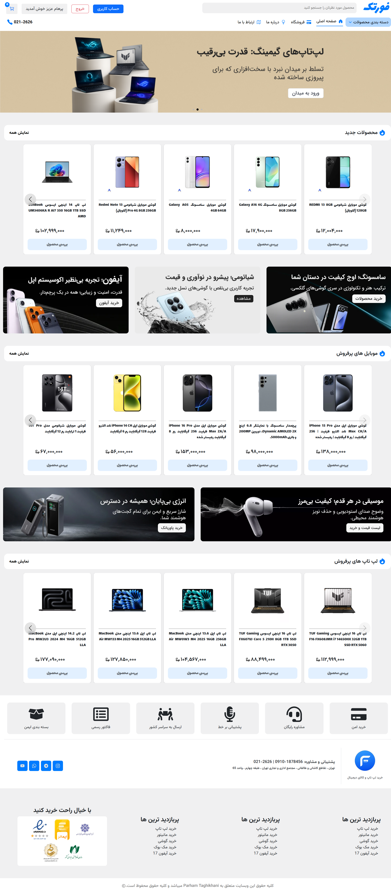
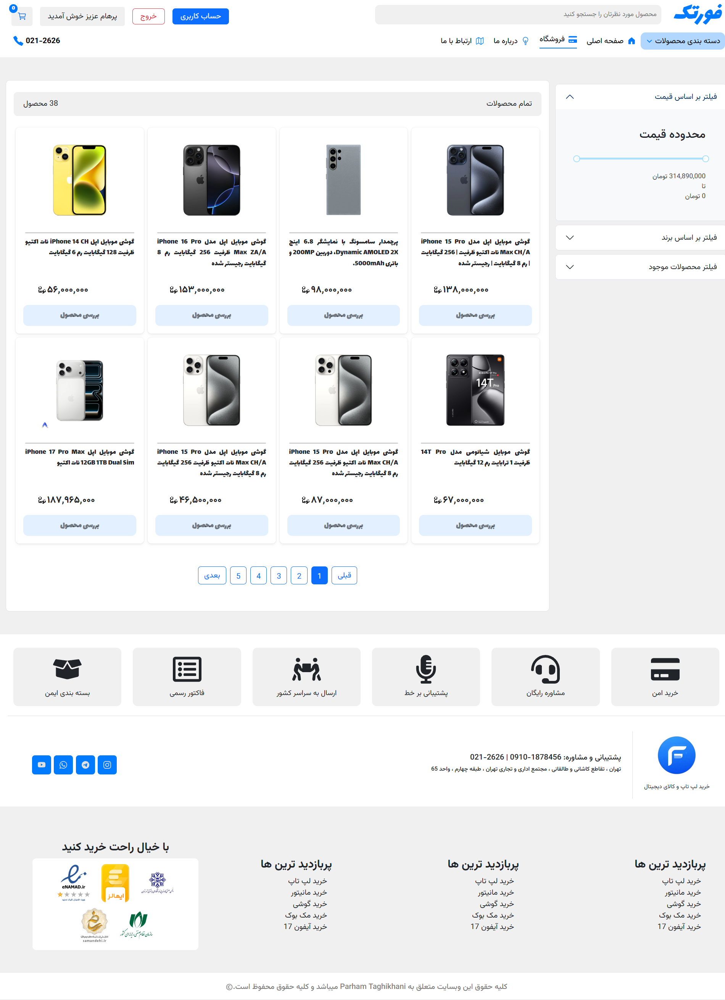

<div dir="rtl">

<p align="left">

🌐 **زبان:** فارسی [🇺🇸 English](./README.md) | 🇮🇷

</p>

---

<div dir="rtl">

# 🛒 ForTech

<p align="center">
<strong>فروشگاه اینترنتی مدرن توسعه‌یافته با React و Vite</strong>
</p>

<p align="center">
ForTech یک فروشگاه اینترنتی واکنش‌گرا است که با استفاده از React توسعه داده شده و امکاناتی مانند احراز هویت کاربران، مدیریت نقش‌ها، سبد خرید، فرایند ثبت سفارش، پنل کاربری و پنل مدیریت را با استفاده از JSON Server برای شبیه‌سازی API ارائه می‌دهد.
</p>

<p align="center">


</p>

> **نکته:** در این پروژه از **JSON Server** برای شبیه‌سازی API استفاده شده و پروژه دارای بک‌اند واقعی نیست.

---

# ✨ امکانات پروژه

- 🔐 ثبت‌نام، ورود و خروج کاربران
- 👥 مدیریت سطح دسترسی کاربران و مدیر (Role-Based Access Control)
- 🛒 سبد خرید
- 💳 فرایند ثبت سفارش
- 🔍 جستجوی محصولات
- 📄 صفحه‌بندی محصولات (Pagination)
- 📱 طراحی کاملاً واکنش‌گرا (Responsive)
- 👤 پنل کاربری
- 📦 مدیریت و مشاهده سفارش‌های کاربر
- ⚙️ پنل مدیریت
- 👥 مدیریت کاربران
- 📱 مدیریت محصولات
- 📦 مدیریت سفارش‌ها
- ✏️ ویرایش محصولات
- ➕ افزودن محصول جدید
- ⚡ نمایش Skeleton هنگام بارگذاری اطلاعات
- 🔔 نمایش اعلان‌ها و پیام‌های سیستم

---

# 🛠 تکنولوژی‌های استفاده‌شده

| بخش              | تکنولوژی                        |
| ---------------- | ------------------------------- |
| Frontend         | React 19, Vite                  |
| مسیردهی          | React Router DOM                |
| مدیریت وضعیت     | Context API                     |
| ارتباط با API    | Axios                           |
| رابط کاربری      | Bootstrap, React Bootstrap, CSS |
| اعلان‌ها         | React Hot Toast, SweetAlert2    |
| اسلایدر          | Swiper                          |
| آیکون‌ها         | React Icons                     |
| مدیریت Meta Tags | React Helmet Async              |
| شبیه‌سازی API    | JSON Server                     |

---

# 📸 تصاویر پروژه

## 🏠 صفحه اصلی



---

## 🛍 فروشگاه



---

## 📱 صفحه محصول

| موبایل                                          | لپ‌تاپ                                           |
| ----------------------------------------------- | ------------------------------------------------ |
| .png>) | .png>) |

---

## 👤 پنل کاربری


---

## ⚙️ پنل مدیریت


---

## 📦 مدیریت محصولات


---

# 🚀 اجرای پروژه

### دریافت سورس پروژه

```bash
git clone https://github.com/Parham-Codes/ForTech.git
```

### نصب وابستگی‌ها

```bash
npm install
```

### اجرای JSON Server

```bash
npx json-server src/DB/db.json --port 4000
```

### اجرای پروژه

```bash
npm run dev
```

---

# 📂 ساختار پروژه

```text
src
├── assets
├── components
├── context
├── pages
├── routes
├── DB
└── main.jsx
```

---

# 👨‍💻 توسعه‌دهنده

**پرهام تقی‌خانی**

GitHub: https://github.com/Parham-Codes
Email: parhamtaghikhani.31@example.com

---

<p align="center">

⭐ اگر این پروژه برای شما مفید بود، خوشحال می‌شوم با دادن یک Star از آن حمایت کنید.

</p>

</div>
